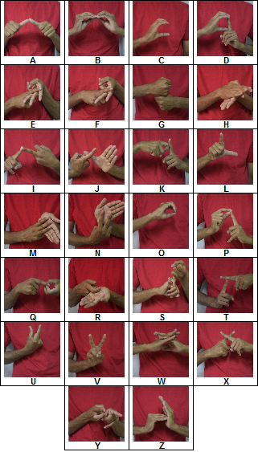

# Two-Hand-Indian-Sign-Language-Alphabets-Classification

## Overview

Currently, a lot of research is going in the field of sign language recognition. Recognition of gesture poses a serious challenge to the system due to inconsistent illuminance and background conditions, different skin colours of the hand and each person has his/her own trait of making the gesture. It gets even more difficult with Two Hand Indian Sign Language (THISL) due to the representation of gesture with both hands. There is no proper THISL dataset available to the public. So, we present a THISL dataset consisting of 26 gestures each representing the English alphabet. This dataset consists of 50x50 images of total 9100 in which each gesture is made of 350 images and it is divided into two parts, training and test. The training set consists of 7020 images and the test set consists of 2080 images. In this project, THISL dataset is validated on various classification models of machine learning(SVM,Knn,Logistic Regression, Latent Discriminant Analysis, Naive Bayes, Decision Tree)  . This dataset serves a very good purpose for benchmarking machine learning algorithms and it is freely available to people on request to authors.

## Dataset Description.

The Dataset consists of 26 classes eaching representing the english alphabet. Sample image of each englishg alphabet is shown below.

## Work Flow

